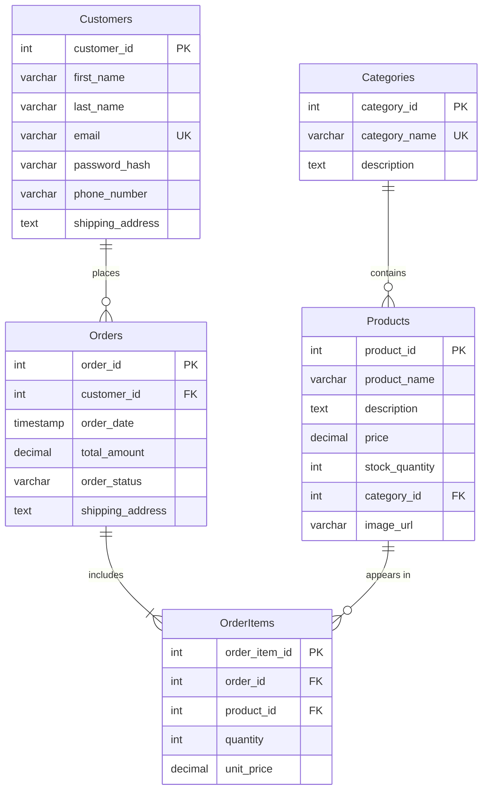

# Amazon-Style E-Commerce Database (MySQL)

A relational database design for a simple online store, inspired by Amazon. It includes the schema, sample data, and 17 practice queries covering filtering, sorting, joins, grouping, and aggregate functions.

## Schema



**Design notes**
- `OrderItems.unit_price` stores the price at the time of purchase, so later price changes don't alter order history.
- `UNIQUE (order_id, product_id)` ensures a product appears once per order (use `quantity` for multiples).
- `Orders.shipping_address` is copied from the customer at order time, so past orders keep their original address.

## Repository structure

```
.
├── sql/
│   ├── 01_schema.sql      # Database and table definitions
│   ├── 02_seed_data.sql   # Sample data (15 rows per main table)
│   └── 03_queries.sql     # 17 example queries
├── .gitignore
└── README.md
```

## Getting started

Requires MySQL 8.x (or MariaDB).

```bash
git clone https://github.com/<your-username>/amazon-sql-database.git
cd amazon-sql-database

mysql -u root -p < sql/01_schema.sql
mysql -u root -p < sql/02_seed_data.sql
mysql -u root -p < sql/03_queries.sql
```

Or run the files in order from MySQL Workbench.

## Queries covered

| Topic | Examples |
|---|---|
| Filtering & sorting | `WHERE`, `ORDER BY`, `LIMIT`, `LIKE`, `BETWEEN` |
| Joins | `INNER JOIN`, `LEFT JOIN`, multi-table joins (4 tables) |
| Aggregation | `COUNT`, `SUM`, `AVG`, `MAX`, `GROUP BY` |

## Notes

- Passwords in the sample data are placeholder strings, not real hashes.
- All sample data is fictional.
